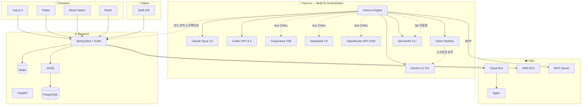

<!-- Animated Header -->

 

<!-- Typing Animation -->

  

<!-- Social Badges -->

 

## 🧑‍💻 About Me

> **문제를 제대로 정의하고 구조적으로 해결하는 개발자**

스타트업에서 실서비스를 개발하며 Vue.js·Flutter·Spring Boot·Kotlin·Swift를 넘나드는 풀스택 개발자입니다.
현재 **Jump**에서 온라인 간판 플랫폼의 **대규모 리팩토링**을 주도하고 있으며, 이전 직장에서는 기획부터 DevOps까지 전 과정을 담당했습니다.
**Multi-AI 오케스트레이션** 시스템을 직접 설계·구현하며, AI를 단순 도구가 아닌 **개발 파이프라인**으로 활용합니다.

 

## 🛠 Tech Stack

### Backend

### Frontend

### Mobile Native

### AI & Data

### Database

### DevOps & Infra

 

## 💼 Work Experience

<table>
<tr>
<td width="120" align="center">
 
<b>현재</b>
</td>
<td>

### 🏢 Jump — 풀스택 개발자
> 온라인 간판 플랫폼 · 에듀사업 · 경조사 플랫폼

- **Spring Boot + Kotlin + JOOQ** 백엔드 + **Vue.js 3** 프론트엔드 + **Swift** iOS 개발
- 레거시 플랫폼 **대규모 리팩토링** 주도 (아키텍처 재설계 + 불필요 모듈 정리)
- 경조사 플랫폼 확장 개발 진행 중

</td>
</tr>
<tr>
<td width="120" align="center">
 
<b>이전</b>
</td>
<td>

### 🏢 WSY (할인꿀팁) — 풀스택 개발자 & 팀 리더
> 위치 기반 매장 할인/쿠폰 알림 서비스

- **Spring Boot** 백엔드 + **Flutter** 고객앱 + **React Native** 사장님앱 + **React** 어드민 개발
- GCP **Cloud Run** 배포 & **Neon PostgreSQL** 운영
- FCM 푸시 알림 · 백그라운드 위치 서비스 · 마케팅 · DevOps 병행

</td>
</tr>
</table>

 

## 🚀 Projects

<!-- Jump -->
<table>
<tr>
<td width="60" align="center">🏢</td>
<td>

### Jump — 온라인 간판 플랫폼
`실서비스` `스타트업` `리팩토링`

> 온라인에서 간판을 확인할 수 있는 플랫폼 + 에듀사업 + 경조사 플랫폼 확장

- Spring Boot + Kotlin + JOOQ 백엔드 & Vue.js 3 프론트엔드 & Swift iOS 앱 풀스택 개발
- 레거시 플랫폼 **대규모 리팩토링** 주도 — 아키텍처 재설계 + 불필요 모듈 제거
- Horcrux Multi-AI를 활용한 코드 분석/리팩토링 전략 수립

</td>
</tr>
</table>

<!-- WSY -->
<table>
<tr>
<td width="60" align="center">🏪</td>
<td>

### WSY 할인꿀팁 — 위치 기반 할인 알림 서비스
`실서비스` `스타트업`

> 사용자 위치 기반으로 주변 매장의 할인/쿠폰 정보를 실시간으로 알려주는 O2O 플랫폼

- Flutter 고객앱 + React Native 사장님앱 + React 어드민 페이지 풀스택 개발
- FCM 푸시 알림 & `Timer.periodic` 백그라운드 위치 추적 구현
- React Native 런타임 크래시 & 배너 이미지 업로드 500 에러 해결 (`axios` → `fetch()` 전환)
- GCP Cloud Run 배포 · Neon PostgreSQL 데이터 관리

</td>
</tr>
</table>

<!-- Horcrux -->
<table>
<tr>
<td width="60" align="center">🤖</td>
<td>

### [Horcrux](https://github.com/dwonc/horcrux) — Multi-AI Orchestration System
`개인 프로젝트` `AI 인프라` `실무 활용`

> **6개 AI를 수렴 기반 토론 루프로 오케스트레이션** + Vision 분석 + QA 자동화

- **Core Pair**: Claude Opus 4.6 (Generator) + Codex 5.4 (Counter-Generator/Critic)
- **Aux Critics**: Gemini 3.1 Pro · Groq/Llama · DeepSeek V3 · OpenRouter GPT-OSS — 병렬 평가
- **Fast v2**: Vision Quick Scan (Gemini 3.1 Pro Vision) → Smart Generator (Opus) → Multi Light Critic 3모델 과반수 합의 → 조건부 Revision
- **Vision Pipeline**: 스크린샷/URL 입력 → Playwright 캡처 → 이미지 분석 → 코드 생성. `image_path`/`image_base64`/`vision_url` 3가지 방식 지원
- **Adaptive Routing**: Task Classifier가 intent/risk/scope 분석 → 5개 모드(auto/fast/standard/full/parallel) 자동 라우팅
- **Compact Memory**: 3-Layer (working/decision/long-term) + Delta Prompting으로 컨텍스트 잘림 방지
- **QA Autofix CLI**: 테스트 실행 → 실패 evidence 수집 → AI 진단 → 패치 생성 → 자동 적용 → 재검증 → 롤백/에스컬레이션 루프
- **Claude Code 연동**: 가이드 문서 기반으로 Claude Code에서 자연어로 Horcrux 직접 호출
- MCP 통합 + Flask 웹서버 + 실시간 SSE 모니터링 UI

</td>
</tr>
</table>

<!-- Aegis Trader -->
<table>
<tr>
<td width="60" align="center">📈</td>
<td>

### [Aegis-Trader](https://github.com/dwonc/Aegis-Trader) — AI 암호화폐 자동매매 시스템
`개인 프로젝트` `AI Trading`

> **4-Layer 분석 엔진** (수치지표 / 차트비전 / 텍스트수집 / AI종합판단)으로 매매 결정

- **Layer 1**: pandas-ta 기반 9종 기술지표 (RSI, BB, MACD, ADX, ATR, OBV, VWAP 등)
- **Layer 2**: Claude Vision으로 TradingView 차트 스크린샷 패턴 분석
- **Layer 3**: 텔레그램 18채널 · Twitter · Reddit · DART 공시 · 뉴스 RSS · 온체인 데이터 수집
- **Layer 4**: Claude Sonnet + RAG로 최종 BUY/SELL/HOLD 결정
- 7개 전략 앙상블 (변동성 돌파, 평균회귀, 모멘텀, 스캘핑, 박스권 돌파, 골든크로스, 급락방어)
- Horcrux 연동으로 XGBoost + LSTM 예측 모델 고도화 진행 중

</td>
</tr>
</table>

<!-- 댕슐랭 -->
<table>
<tr>
<td width="60" align="center">🐶</td>
<td>

### 댕슐랭 — AI 반려견 견종 분석 & 맞춤 영양 추천
`팀 미니 프로젝트` `AI 서비스`

> 사진 한 장으로 견종 분석 → 유전병 위험도 평가 → 맞춤 레시피 & AI 영양 상담

- TensorFlow `model_1.h5` 기반 견종 분류 AI + GPT-4o-mini 영양 상담
- **LLM 스트리밍**: SSE 기반 실시간 레시피 요약 (AsyncOpenAI + ReadableStream)
- **KV캐싱 최적화**: 시스템 프롬프트 100% 고정 → OpenAI 자동 캐싱 극대화
- 비회원 기능 (IP 기반 하루 3회 제한), 드래그 가능한 플로팅 챗봇
- Horcrux로 LLM 처리 속도 최적화 (싱글톤 클라이언트, few-shot 인라인 통합)

</td>
</tr>
</table>

<!-- IT-DA -->
<table>
<tr>
<td width="60" align="center">🎯</td>
<td>

### [IT-DA](https://github.com/dwonc/it-da) — AI 모임 추천 플랫폼
`부트캠프 팀 프로젝트` `팀 리더`

> **LightGBM + SVD + GPT** 앙상블로 사용자 맞춤 모임을 추천하는 서비스

- Spring Boot + FastAPI **마이크로서비스** 아키텍처 설계
- 추천 점수 40~60% 편중 → **Feature Scaling** + Intent 가중치 조정으로 분포 정규화
- Spring Boot → FastAPI 간 **422 에러**: Pydantic `AliasGenerator`로 camelCase/snake_case 자동 변환
- WebSocket STOMP 실시간 채팅 · OAuth2 소셜 로그인 · Redis 세션 관리
- AWS EC2 + Docker + Nginx 배포

</td>
</tr>
</table>

<!-- GUGU Market -->
<table>
<tr>
<td width="60" align="center">🛒</td>
<td>

### [GUGU Market](https://github.com/dwonc/gugumarket_frontend) — 중고거래 플랫폼
`부트캠프 팀 프로젝트` `팀 리더`

> 실시간 채팅 · 카카오페이 결제 · 소셜 로그인이 통합된 중고거래 서비스

- WebSocket 1:1 실시간 채팅 & Spring Security + JWT 인증 구현
- 카카오 소셜 로그인 · 카카오페이 결제 연동
- AWS EC2 + RDS 배포 · Let's Encrypt SSL 적용
- 배포 후 API 경로 `/api/api` 중복 문제 발견 · 해결

</td>
</tr>
</table>

<!-- Celeb Lookalike -->
<table>
<tr>
<td width="60" align="center">🪞</td>
<td>

### Celeb Lookalike — AI 닮은꼴 연예인 찾기
`개인 미니 프로젝트`

> 셀카 한 장으로 가장 닮은 한국 연예인 TOP 3를 찾아주는 웹앱

- DeepFace(VGG-Face) 임베딩 + 코사인 유사도 매칭
- 연예인 사진 자동 크롤링 파이프라인 (icrawler → bing → duckduckgo fallback)
- Streamlit Cloud 배포 · 임베딩 캐시로 실시간 응답

</td>
</tr>
</table>

<!-- AI Influencer Matching -->
<table>
<tr>
<td width="60" align="center">📊</td>
<td>

### AI 인플루언서-브랜드 매칭 플랫폼
`AI 부트캠프 팀 프로젝트` `기획 & 핵심 컨셉`

> GPT API로 인플루언서 프로필과 브랜드 가치를 분석해 최적 매칭을 추천하는 B2B 플랫폼

- 핵심 컨셉 기획 & 1주일 MVP 스코프 설계
- 양방향 매칭 (브랜드→인플루언서, 인플루언서→브랜드) + AI 매칭 점수 & 코멘트
- 캠페인 시뮬레이터: 예산별 3가지 시나리오 자동 생성

</td>
</tr>
</table>

 

## 💡 Problem Solving Highlights

<b>🔍 Fast v2 Vision — 스크린샷 한 장으로 UI 버그 자동 수정</b>

 

**상황**: Claude Code 단일 모델로 스크린샷 기반 UI 수정 시 루프를 돌며 정확한 수정을 못 하는 문제
**원인**: 단일 모델은 이미지 분석 → 문제 파악 → 코드 생성을 한 번에 처리하려다 정확도가 떨어짐
**해결**: Horcrux Fast v2 파이프라인 설계 — Gemini 3.1 Pro Vision으로 이미지 분석(이슈 추출) → Opus 4.6 Generator에 vision context 주입 → 3모델(Codex+Gemini Pro+DeepSeek) 과반수 합의 critic
**결과**: 깨진 대시보드 UI 스크린샷에서 5개 이슈 자동 감지 + 수정된 전체 HTML/CSS 코드 생성 (8.0/10)

<b>🔍 AI 추천 점수 차별화 — 점수가 전부 비슷하게 나오는 문제</b>

 

**상황**: IT-DA에서 LightGBM + SVD 추천 점수가 40~60%에 몰려서 모임 간 차이가 안 보였음  
**원인**: MinMaxScaler가 극단값에 민감해서 중간 구간이 압축됨  
**해결**: Feature Scaling 방식 변경 + Intent 기반 가중치 조정으로 0~100% 전 구간에 고르게 분포  
**결과**: 사용자가 "왜 이 모임을 추천했는지" 명확하게 체감 가능

<b>🔍 Spring Boot → FastAPI 422 에러 — camelCase vs snake_case 충돌</b>

 

**상황**: Spring Boot에서 FastAPI로 JSON 요청 시 422 Unprocessable Entity 반복 발생  
**원인**: Spring Boot는 camelCase, FastAPI(Pydantic)는 snake_case로 필드명 불일치  
**해결**: Pydantic `AliasGenerator`를 활용해 camelCase → snake_case 자동 변환  
**결과**: 양쪽 코드 수정 없이 API 통신 정상화

<b>🔍 React Native 배너 이미지 업로드 500 에러</b>

 

**상황**: WSY 사장님앱에서 배너 이미지 업로드 시 서버 500 에러 발생  
**원인**: axios의 multipart/form-data 처리가 React Native Web에서 정상 동작하지 않음  
**해결**: axios → native `fetch()` API로 전환하여 FormData 직접 전송  
**결과**: Web·Mobile 모두 이미지 업로드 정상 동작

<b>🔍 Multi-AI 오케스트레이션 — Horcrux 자기 자신의 컨텍스트 잘림 문제</b>

 

**상황**: Horcrux에게 "Interactive Mode 설계" task를 돌렸더니, revision 단계에서 출력이 잘리고 pipeline이 hang  
**원인**: Codex reviser의 출력 토큰 한계 + 긴 content를 delta 없이 전체 전달하는 구조  
**해결**: Compact Memory (3-Layer) + Delta Prompting 설계 → revision 시 blocking issues 기반 delta만 전달. 별도로 Gemini 빈 응답 retry 로직 + Codex tool-use guard 프롬프트 추가  
**결과**: "컨텍스트 잘림 방지 기능"을 만드는 과정에서 자기 자신의 잘림을 경험 → 설계의 필요성을 실전으로 증명

<b>🔍 LLM 응답 속도 최적화 — Debate Chain으로 구조 개선</b>

 

**상황**: 댕슐랭 레시피 AI 요약 응답이 느림 (동기 전체 대기 방식)  
**원인**: OpenAI 클라이언트 매번 생성 + few-shot을 파일에서 매번 읽기 + KV캐싱 비효율  
**해결**: Horcrux(구 Debate Chain)로 3개 AI가 최적화 방안 토론 → AsyncOpenAI 싱글톤 + few-shot 인라인 통합 + 시스템 프롬프트 100% 고정  
**결과**: KV캐싱 히트율 극대화 + SSE 스트리밍으로 체감 속도 대폭 향상

 

## 🌱 Currently Learning

| 분야 | 학습 내용 | 기간 |
|:---:|:---|:---:|
| 🤖 **AI Orchestration** | Multi-Model 파이프라인 · Vision 분석 · QA 자동화 | 진행 중 |
| 🔗 **MCP** | Model Context Protocol · Claude Code 연동 | 진행 중 |
| 📊 **ML/DL** | XGBoost · LSTM · Transformer (금융 예측 특화) | 진행 중 |
| 📱 **Mobile Native** | Swift (iOS) · Kotlin (Android) | 2026.04 ~ |

 

## 📊 GitHub Stats

  

  

<!-- Activity Graph -->

 

## 🏗 Architecture I Build

 

---

 

**"문제를 제대로 정의하고 구조적으로 해결하는 개발자가 되고 싶습니다."**

 

